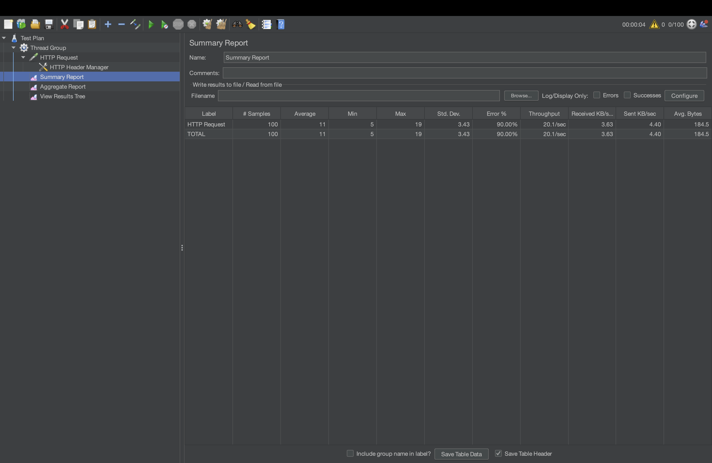
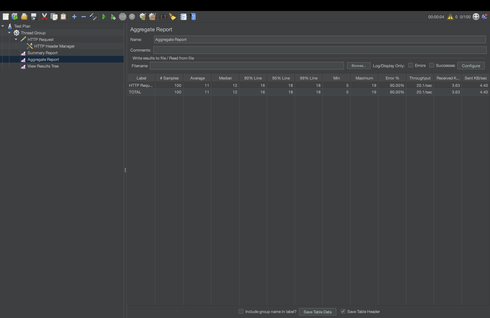
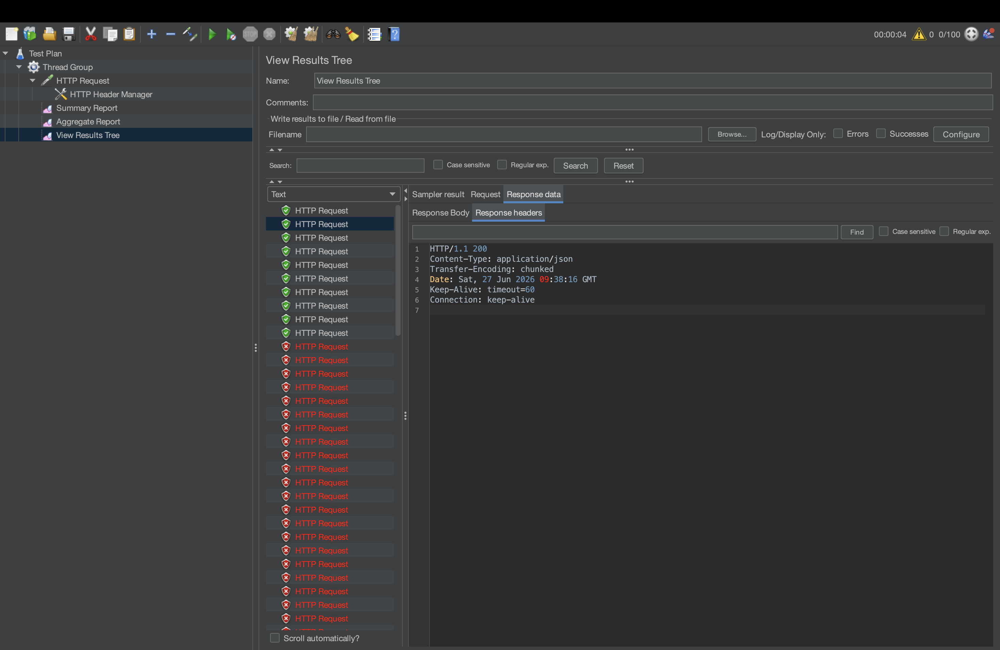

# Flash Sale Inventory Lock

A backend service that prevents inventory overselling during high-traffic flash sales — the exact failure mode that hits e-commerce platforms like Flipkart, Amazon, and Swiggy Instamart when thousands of users try to buy the same limited-stock item at once.

Built and load-tested to guarantee **zero oversells**, even when concurrent requests outnumber available stock by 10x.

## The problem

When a flash sale goes live, hundreds or thousands of users hit "Buy Now" on the same product within milliseconds of each other. Without proper concurrency control, multiple requests can read the same stock count, all see it as available, and all successfully decrement it — resulting in more orders than inventory actually exists.

## The solution

Every purchase request acquires a Redisson distributed lock scoped to the specific product before checking or modifying stock. This guarantees that only one request can read-check-decrement that product's inventory at a time — even across multiple application instances, which is what makes this approach work in a real horizontally-scaled deployment, unlike a plain in-memory `synchronized` block.

```
Client → Spring Boot API → Redisson Lock (per product) → MySQL (stock + orders)
                                    │
                              Redis (lock state)
```

If the lock can't be acquired in time, the request fails fast with `429 Too Many Requests` instead of queuing and degrading the whole system. If stock has run out by the time the lock is acquired, the request returns `409 Conflict` without writing anything to the database.

As a second line of defense, the `Product` entity carries a JPA `@Version` field. If the Redis lock is unavailable or its lease expires under load, the database itself rejects stale-version writes; the purchase service retries a small bounded number of times before returning `409 Conflict`. Correctness no longer rests on Redis being healthy.

## Proven results

Load tested with Apache JMeter: 100 concurrent purchase requests fired at a product with 10 units of stock.

| Metric | Result |
|---|---|
| Total requests | 100 |
| Successful purchases | 10 |
| Out-of-stock rejections | 90 |
| Final stock | 0 |
| Overselling | **None** |





## Tech stack

**Core:** Java 25, Spring Boot 3, Spring Data JPA
**Concurrency & caching:** Redis, Redisson (distributed locking)
**Persistence:** MySQL
**Testing:** JUnit 5, Mockito, Apache JMeter
**Infra:** Docker, Docker Compose

## API

**`POST /api/v1/purchase`**

```json
// Request
{ "userId": 1, "productId": 1 }

// Success response
{ "orderId": 1, "userId": 1, "productId": 1, "orderStatus": "CONFIRMED" }
```

| Status | Meaning |
|---|---|
| `200` | Purchase confirmed |
| `404` | Product not found |
| `409` | Out of stock or concurrent stock-update conflict |
| `429` | Lock not acquired — too many concurrent requests, retry |

**`GET /api/v1/stock/{productId}`** — returns current available stock.

## Architecture

```
controller   → handles HTTP requests/responses
service      → business logic, lock acquisition, stock validation
repository   → Spring Data JPA, MySQL access
config       → Redisson client setup
exception    → centralized error → HTTP status mapping
```

## Running locally

```bash
docker compose up --build
```

This starts the Spring Boot app alongside MySQL and Redis as a single reproducible environment.

## Running tests

```bash
mvn test
```

Includes unit tests for the service layer and integration tests for both controllers.

## What this project demonstrates

- Distributed locking with Redisson, including correct lock release in a `finally` block and ownership checks via `isHeldByCurrentThread()`
- Two-layer concurrency control — Redis distributed lock plus JPA `@Version` optimistic locking — so correctness doesn't depend on Redis alone
- The distinction between database transactions (atomic writes) and distributed locks (cross-instance coordination) — and why both are needed together
- Fail-fast design under load instead of unbounded request queuing
- Load testing methodology and interpreting concurrency results

## Author

Amit Kumar Yadav
